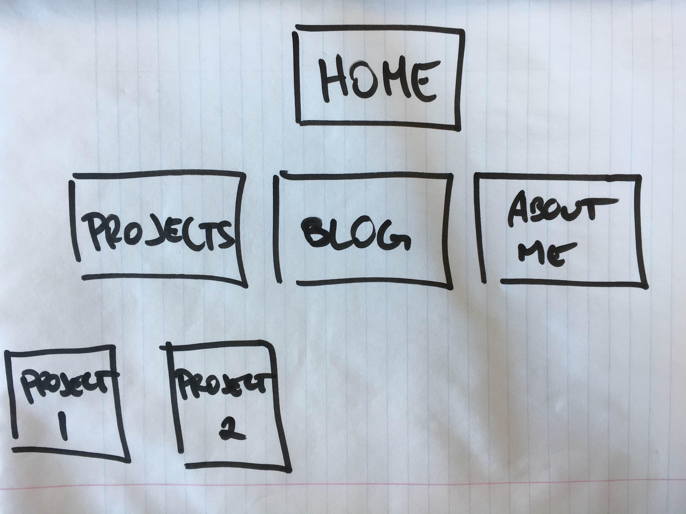

**What are the 6 Phases of Web Design?**

	1. Information gathering: The first step in web design is to find out and understand the things that makeup the website.
	2. Planning: Putting together the information gathered and creating a plan for the site. This is usually when a Sitemap is used. A Sitemap is basically a brainstorm if all the ideas you have gathered.
	3. Design: This step is where you provide and style and feel of the website thats also based on the previous information you have taken.
	4. Development: This is where the website is created and everything is put together.
	5. Testing and Delivery: This is the final check or test run of the website. Checking for issues and or bugs with the website will be done in this phase.
	6. Maintenance: This will be the follow up and continued update of the website. To ensure that the website is still functioning properly and being updated.

**What is your site's primary goal or purpose? What kind of content will your site feature?**

	My sites primary goal will be to provide my audience a chance to get to know me and the things that I have accomplished. It will have a portfolio of the work that I have completed and are proud of. It will also describe me and my hobbies.

**What is your target audience's interests and how do you see your site addressing them?**

	My target audience will be fellow aspiring developers and possibly potential employers.
	My site will be the place where I can show off everything I have learned.

**What is the primary "action" the user should take when coming to your site? Do you want them to search for information, contact you, or see your portfolio? It's ok to have serveral actions at once, or different actions for different kinds of visitors.**

	The user will be able to look into my projects, read my blog, see my contact information and social networks, and also see my personal hobbies and other projects.

**What are the main things someone should know about design and user experience?**
	
	One main thing is the "feel" of the project. No matter how your project is designed it will always come down on how the user or viewer feels about it. Definitely taking your target audience into account plays a huge role in how they will feel about your design. Another aspect is compatibility and ease of use. People like being connected and having a convenient user experience with no issues.
	Updates are also pretty big as you dont want a project to be outdated. Time plays a huge role in that also as updates need to be fast.

**What is user experience design and why is it valuable?**

	As our technology becomes more and more advanced, the end user will want more stimulation from the everyday things in life. That means new devices and the applications that come with them. Having everything be compatible with each other and being able to access those things are vital as they are constantly changing. We need to keep up with the changes and provide the end user with the stimulation that they want and need. That is why user experience design is important.

**Which parts of the challenge did you find tedious?**

	I personally felt that creating the sitemap was tedious. I had trouble because I had tried to use the sitemap makers that were linked but I did not want to sign up for a trial. I tried one but could not save it as an image. I finally just decided to draw it on paper and take a picture so that I can save it as an image in the directory.