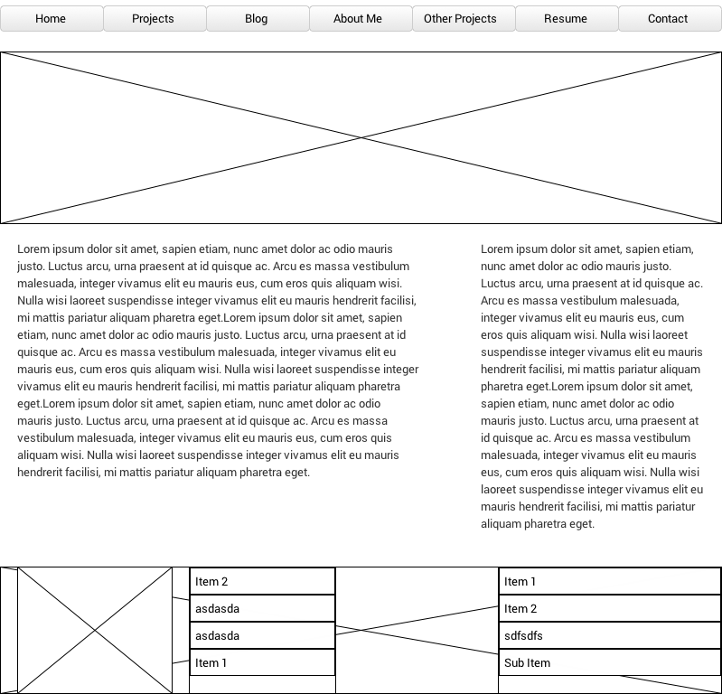
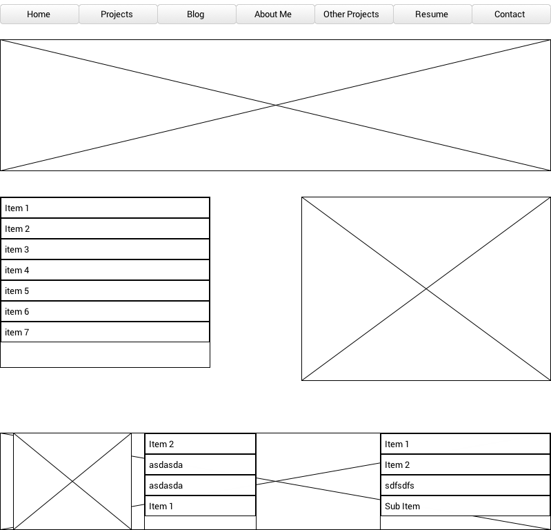

_________________________________________________

**What is a wireframe?**
	
	A wireframe is a very basic layout of your website, app, or project. Think of it as a brainstorm of your ideas quickly put on paper. It sets the baseline of what your project will eventually be.

**What are the benefits of wireframing?**

	Wireframing allows you to plan your design and makes it easier to process all the information which will be the foundation of your project. It is like the blueprint when building a house. Wireframing is also a great tool when creating the user experience. It allows you to simulate how your website feels and how it interacts with the user.

**Did you enjoy wireframing your site?**

	I really enjoyed wireframing my site because I like tinkering with all the different types of options available to me using a wireframing program. Personalizing it is very addicting and I can tell I will be spending alot of time on this part of any project.

**Did you revise your wireframe or stick with your first idea?**
	
	I stuck with my first idea because I know that if I change it I will end up spending too much time on it. I'm pretty content on how it is right now. The good thing is I can always change it in the future.

**What questions did you ask during this challenge? What resources did you find to help you answer them?**

	I was initially confused with creating the blog/index part of the challenge. I was not sure if we had to create a separate page for the blog. Knowing I was confused I took some time off of the challenge to do something else and when I came back to it and read it thoroughly I finally understood.

**Which parts of the challenge did you enjoy and which parts did you find tedious?**

	I really enjoyed wireframing my website. I felt totally in control and I love the freedom of personalization. The part I found tedious was actually using the program I had downloaded for wireframing. After a couple tutorials and trials I got some of the basics down.