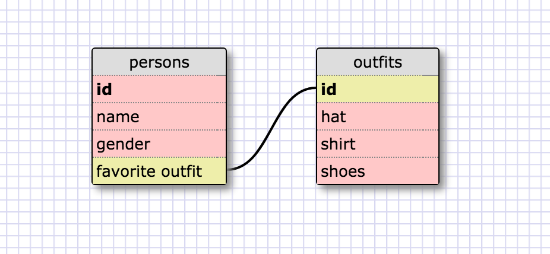

<!-- Release 5 -->

SELECT * FROM states;

SELECT * FROM regions;

SELECT state_name, population FROM states;

SELECT state_name, population FROM states ORDER BY population DESC;

SELECT state_name FROM states WHERE region_id = 7;

SELECT state_name, population_density FROM states WHERE population_density > 50 ORDER BY population_density ASC;

SELECT state_name FROM states WHERE population BETWEEN 1000000 AND 1500000;

SELECT state_name, region_id FROM states ORDER BY region_id ASC;

SELECT region_name FROM regions WHERE region_name LIKE '%Central%';

SELECT regions.region_name, states.state_name FROM regions INNER JOIN states ON states.region_id = regions.id;

<!-- REFLECTION -->

What are databases for?

	databases are used to organize data and make it simpler to access.

What is a one-to-many relationship?

	a one to many relationship means that only one thing is related to another but that other is related to many.

What is a primary key? What is a foreign key? How can you determine which is which?
	
	a primary key is the unique id of a table and a foreign key is the unique id referencing the primary key. A primary key is unique to that table and a foreign key is a field in a table that references a primary key in another table. A primary key cannot have null values but a foreign key can have multiple.

How can you select information out of a SQL database? What are some general guidelines for that?

	You can select by row, column, by id, by keys, you can add booleans and also conditions in your selections. 

